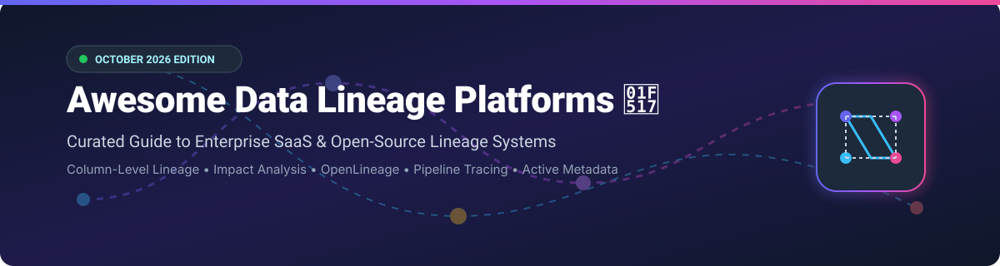

# Awesome Data Lineage Platform 🌐

  
  
  
  
  

## 🚀 Top Data Lineage Platforms Ecosystem

> **Curated List of Enterprise SaaS Products & Open-Source GitHub Projects**  
> *Focused on Column-Level Lineage, Impact Analysis, Pipeline Tracing, Open Standards & End-to-End Data Flow Visibility.*

📅 **Last updated: October 2026**

---

### 🔍 Overview & Market Insights

This repository tracks notable **SaaS platforms** and **open-source projects** for **Data Lineage**. These systems map how data moves from sources through transformations to reports, models, and applications—enabling impact analysis, root-cause debugging, data quality management, and compliance governance.

📊 **Market Size & Structure**:  
The global Data Lineage & Active Metadata market is estimated at **$1.87 Billion to $2.0 Billion in 2026**, growing at a CAGR of **~22%** towards **$4.5+ Billion by 2030**. The sector is **moderately fragmented**: enterprise governance suites (Microsoft, Informatica, Collibra) dominate large legacy estates, while cloud-native active metadata platforms (Atlan, Secoda, Monte Carlo) and open-source standards (OpenLineage, DataHub) capture modern data stack ecosystems.

---

## 📑 Table of Contents

- [☁️ SaaS / Hosted Platforms](#-saas--hosted-platforms)
- [🔓 Open-Source GitHub Projects](#-open-source-github-projects)
- [🛠️ Key Open-Source Frameworks & Patterns](#-key-open-source-frameworks--patterns)
- [📈 Star History](#-star-history)
- [🤝 How to Contribute](#-how-to-contribute)
- [☕ Support & Feedback](#-support--feedback)
- [⚠️ Disclaimer](#%EF%B8%8F-disclaimer)

---

## ☁️ SaaS / Hosted Platforms

> [!NOTE]
> Enterprise SaaS solutions deliver automated code parsing, automated lineage discovery across complex BI/ETL stacks, active metadata management, and enterprise governance integrations.

| Platform / Vendor 🏢 | Starting Price 💰 | Free Tier / Trial Limit 🎁 | Enterprise Size / Valuation / Revenue 📊 | Description & Core Focus 🎯 |
| :--- | :--- | :--- | :--- | :--- |
| **[Microsoft Purview](https://azure.microsoft.com/products/purview/)** 💻 | $0.40/map unit/hr (~$292/mo base) | 30-day Free Trial with 800 Map Unit Hours & 100 Enterprise Data Catalog units | **$3.2 Trillion** market cap (Parent: Microsoft) | Enterprise governance and lineage service integrated across Azure, M365, and hybrid data estates. |
| **[Informatica EDC](https://www.informatica.com/)** 🏭 | $2,000/month (IPU usage-based starter) | 30-day Free Trial on Informatica Intelligent Data Management Cloud (IDMC) | **$7.5 Billion** market cap (~$1.6B Annual Revenue) | AI-powered enterprise data catalog with deep lineage parsing across cloud & legacy ETL systems. |
| **[Collibra](https://www.collibra.com/)** 🏛️ | $170,000/year (~$14,166/mo enterprise base) | 14-day guided sandbox demo trial | **$5.25 Billion** valuation (~$100M+ ARR) | Enterprise data intelligence and governance platform with end-to-end lineage & stewardship workflows. |
| **[Monte Carlo](https://www.montecarlodata.com/)** 📉 | $15,000/year starter package | 14-day Free Trial (up to 5 data warehouse connections) | **$1.6 Billion** valuation (~$40M ARR) | Data observability platform combining automated data lineage with incident investigation and impact analysis. |
| **[Alation](https://www.alation.com/)** 💡 | $19,800/year (10-user starter tier) | 14-day Free Trial (Guided catalog & lineage sandbox) | **$1.7 Billion** valuation (~$100M+ ARR) | Data intelligence platform combining data catalog, column-level lineage, and behavioral insights. |
| **[Manta](https://www.getmanta.com/)** ⚙️ | $40,000/year base platform license | 14-day Proof-of-Concept / Guided Demo Trial | **$500 Million** (Acquired by IBM in 2023) | Deep code-level automated lineage specialized in complex SQL, ETL pipelines, and legacy systems. |
| **[Atlan](https://atlan.com/)** 🚀 | $30,000/year starter subscription | 14-day Free Trial (Full platform access for modern data stacks) | **$750 Million** valuation ($50M Series C in 2024) | Active metadata platform providing automated column lineage for Snowflake, dbt, Databricks, and BI. |
| **[Acceldata](https://www.acceldata.io/)** ⚡ | $30,000/year enterprise starter | 14-day Free Trial (Data observability & pipeline tracing) | **$300 Million** valuation ($50M Series C) | Multimodal data observability platform covering pipeline tracing, data health, and automated lineage. |
| **[DataHub (Acryl Data)](https://datahubproject.io/)** 🔷 | $1,000/month (Acryl Managed Cloud Starter) | 14-day Free Trial on Acryl Cloud | **$120 Million+** valuation (Series A funded by 8VC & Insight) | Commercial managed platform built on open-source DataHub with real-time column lineage & governance. |
| **[Secoda](https://www.secoda.co/)** 🤖 | $99/month (Starter Plan) | Free Forever Plan (up to 5 users & 1,000 metadata assets) | **$75 Million** valuation ($14M Series A) | AI-assisted data catalog, AI prompt search, and automated column-level lineage platform. |
| **[Octopai](https://www.octopai.com/)** 🐙 | $15,000/year base tier | 14-day Free Trial / Instant Demo Sandbox | **$60 Million** (Acquired by Cloudera in 2024) | Automated metadata search and cross-system data lineage focused on BI and reporting environments. |
| **[OvalEdge](https://www.ovaledge.com/)** 📐 | $1,000/month (~$12,000/year starter) | 14-day Free Trial (Full data catalog & lineage tool) | **$40 Million** estimated valuation | Affordable enterprise data catalog and governance tool with broad lineage connectors. |
| **[DataGalaxy](https://www.datagalaxy.com/)** 🌌 | $12,000/year starter package | 14-day Free Trial (Collaborative catalog & lineage space) | **$30 Million** valuation ($10M Series A) | Collaborative data knowledge platform linking business glossaries with technical data lineage. |
| **[CastorDoc](https://www.castordoc.com/)** 🗂️ | $9,000/year (Starter Tier) | 14-day Free Trial (Up to 3 data warehouse integrations) | **$25 Million** valuation ($23.5M total funding) | AI-driven data documentation, catalog, and automated column-level lineage for analytics teams. |
| **[OpenLineage Ecosystem](https://openlineage.io/)** 🌐 | Commercial support included via partners | Fully Free & Open-Source (Apache 2.0 License) | Open Standard Ecosystem (Supported by Databricks, Astronomer, Microsoft) | Open framework for lineage collection via API events emitted from Airflow, Spark, dbt, and Flink. |

---

## 🔓 Open-Source GitHub Projects

> [!TIP]
> Open-source projects offer standards, framework connectors, and self-hosted platforms for data lineage tracking. Projects below are sorted by GitHub Star Count (descending) 🌟.

- **[dbt-core](https://github.com/dbt-labs/dbt-core)**  🛠️  
  *Transform data in your warehouse with SQL and built-in model & column lineage graphing.*

- **[OpenMetadata](https://github.com/open-metadata/OpenMetadata)**  📚  
  *All-in-one open-source data governance platform featuring end-to-end column lineage, data quality, and team collaboration.*

- **[DataHub](https://github.com/datahub-project/datahub)**  🔷  
  *LinkedIn's open-source metadata platform providing real-time stream-based metadata ingestion and graph-based lineage.*

- **[sqlglot](https://github.com/tobymao/sqlglot)**  ⚡  
  *Comprehensive SQL parser and transpiler engine capable of building detailed column-level SQL lineage trees across 20+ dialects.*

- **[OpenLineage](https://github.com/OpenLineage/OpenLineage)**  🌐  
  *Open standard for lineage event collection—instruments Spark, Airflow, dbt, Flink, and Dagster jobs in production.*

- **[Marquez](https://github.com/MarquezProject/marquez)**  🎯  
  *LF AI & Data foundation project serving as the reference implementation backend for storing and visualizing OpenLineage metadata.*

- **[Apache Atlas](https://github.com/apache/atlas)**  🐘  
  *Scalable open-source metadata management and governance framework built for Apache Hadoop ecosystem data flows.*

- **[sqllineage](https://github.com/reata/sqllineage)**  🐍  
  *Python-based SQL lineage parser that analyzes raw SQL statements to visualize source-to-target table and column lineage.*

- **[Egeria](https://github.com/odpi/egeria)**  🏛️  
  *OMAG (Open Metadata and Governance) standard for federating metadata and lineage exchange across heterogeneous data tools.*

---

## 🛠️ Key Open-Source Frameworks & Patterns

1. **Event-Driven Collection**: Instrument data pipelines with **OpenLineage** integration hooks (Airflow, Spark, Flink).
2. **Metadata Repository**: Ingest lineage streams into **DataHub**, **OpenMetadata**, or **Marquez**.
3. **SQL Transformation Parsing**: Leverage **sqlglot** or **sqllineage** inside custom CI/CD pipelines to validate column impact analysis before deploying SQL migrations.
4. **Hybrid Architectures**: Combine open-source lineage producers with enterprise catalog tools for centralized compliance reporting.

---

## 📈 Star History

---

## 🤝 How to Contribute

Contributions are warmly welcome! Please follow these simple steps:

1. Fork the repository 🍴
2. Create your feature branch (`git checkout -b feature/add-lineage-tool`)
3. Add your entry keeping descriptions factual and neutral
4. Submit a Pull Request 🚀

---

## ☕ Support & Feedback

If you find this repository helpful, please consider giving it a **Star ⭐️**, sharing it with fellow data engineers, or sponsoring the project!

  

Thank you for supporting open data engineering resources! ❤️

---

## ⚠️ Disclaimer

- This list is **community-curated** for informational and educational purposes.
- Product pricing, features, and valuations change over time. Verify specifications on official vendor documentation.

---

<b>Made with ❤️ for Data Engineers, Analytics Engineers & Governance Teams.</b>

